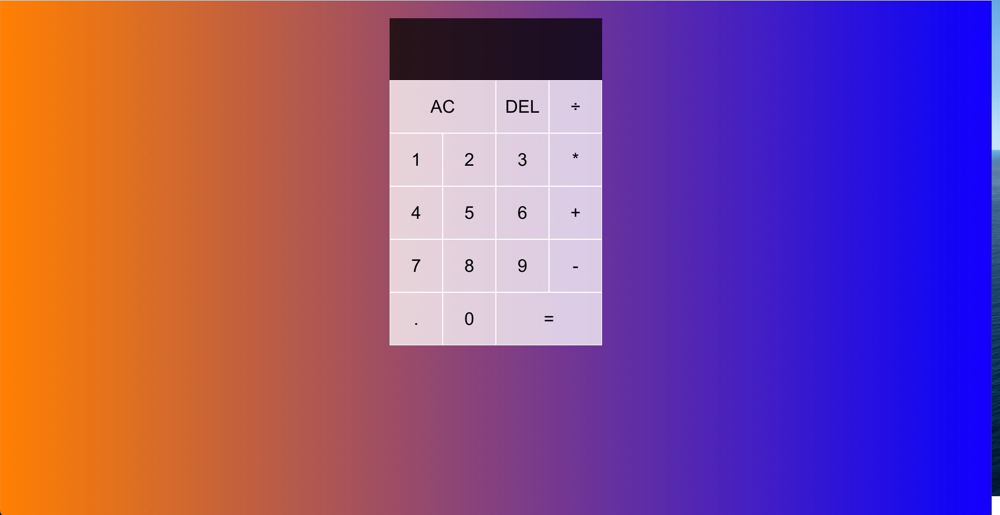

# React Calculator 2.0
  
  ## ReadMe Description 

  This is a better version of my first inital React Calculator 
  ## Table of Contents: 

  * [Installation](#installation) 

  * [Contributors](#contributors) 

  * [Usage](#usage) 

  * [Tests](#tests) 

  * [Questions](#questions) 

  * [License](#license) 

  ## Name: 

  Sebastian Tischner

  ## Installation 

  No Installation

  ## Contributors 

  Fork Repository

  ## Usage 

  Use as a normal calculator 

  ## Tests 

  No test instructions.

  ## License 
 
  This project is protected by the MIT license.

  ## Questions 

  Feel free to contact me with any questions! 

  Github: [Sebascrab](https://github.com/Sebascrab) 

  Email: alexanders.tischner@outlook.com 

  

  

